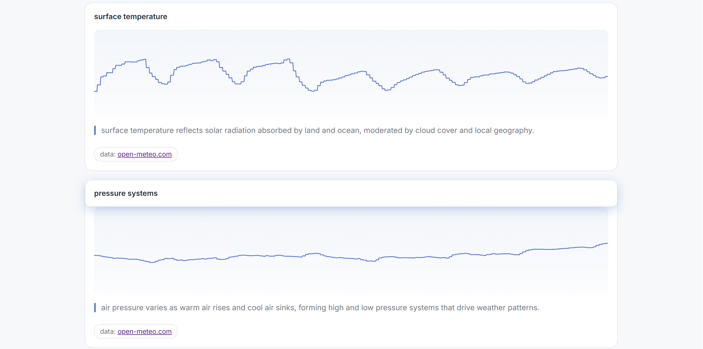

# atmos

weather visualization using animated waveforms. see how temperature, pressure, and wind patterns shift across time and location.

## features
- **surface temperature**, **pressure systems**, and **wind motion** as animated waves  
- search for a location or use geolocation (never stored)
- city autocomplete for disambiguation
- light and dark mode
- inline explanations of atmospheric processes
- hover for exact data values

## how it works
atmos uses the **Open-Meteo API**, which aggregates data from trusted meteorological sources such as NOAA, ECMWF, and national weather services.

weather variables are normalized and mapped to wave amplitude and motion:
- higher values appear visually higher
- wave speed subtly varies with latitude
- color shifts reflect hemispheric position

this makes patterns comparable across locations while still grounded in real measurements.

### data & accuracy
all weather data comes directly from:
- **Open-Meteo** (https://open-meteo.com/)
- underlying sources include **NOAA**, **ECMWF**, and other national meteorological agencies

interactive hover tooltips display the exact values used in each visualization so users can verify what they’re seeing.

### privacy
- location data is **never stored**
- geolocation is used only locally to fetch weather data
- no accounts, cookies, or tracking

### preview
#### start screen

#### atmospheric visualizations

#### built for
hack club sleepover 💤
